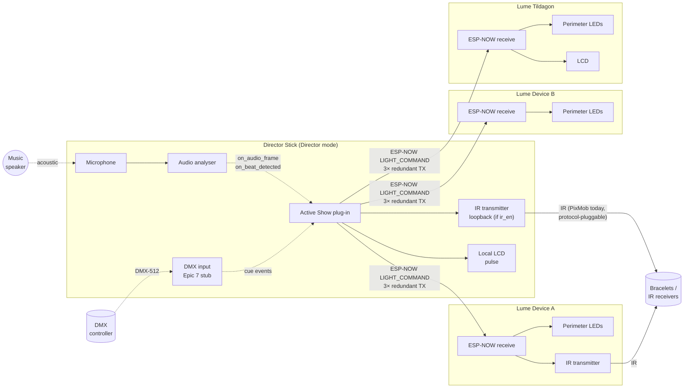
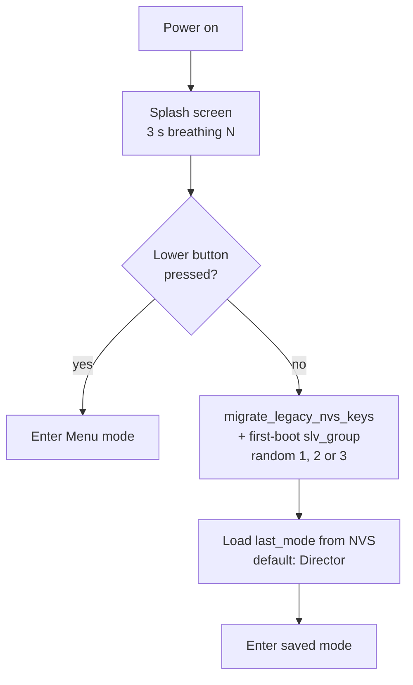
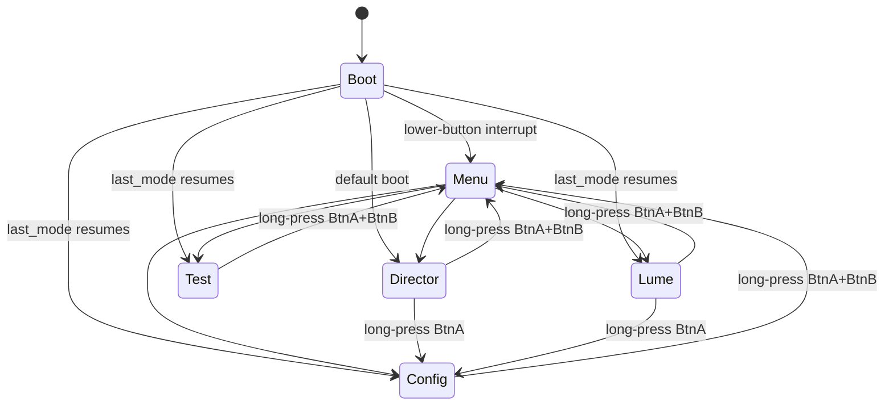
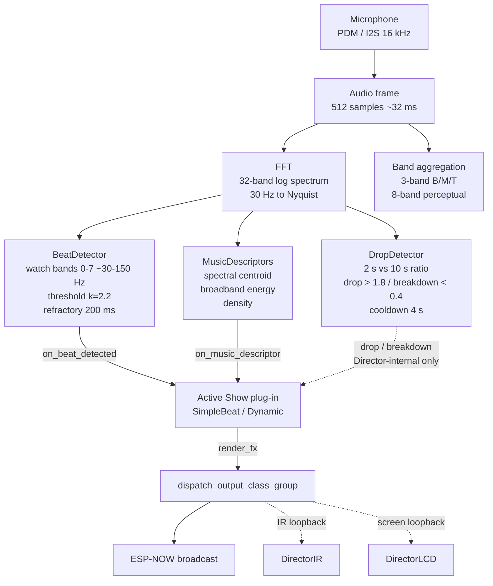
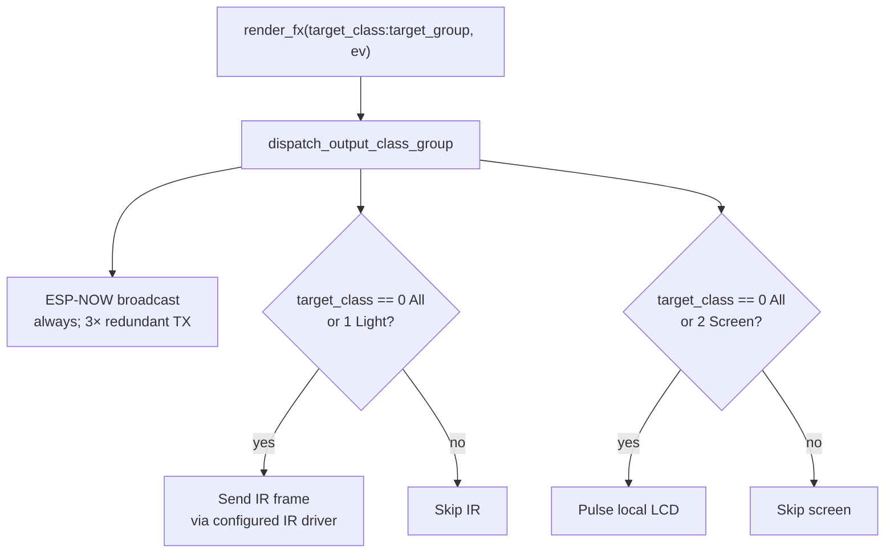
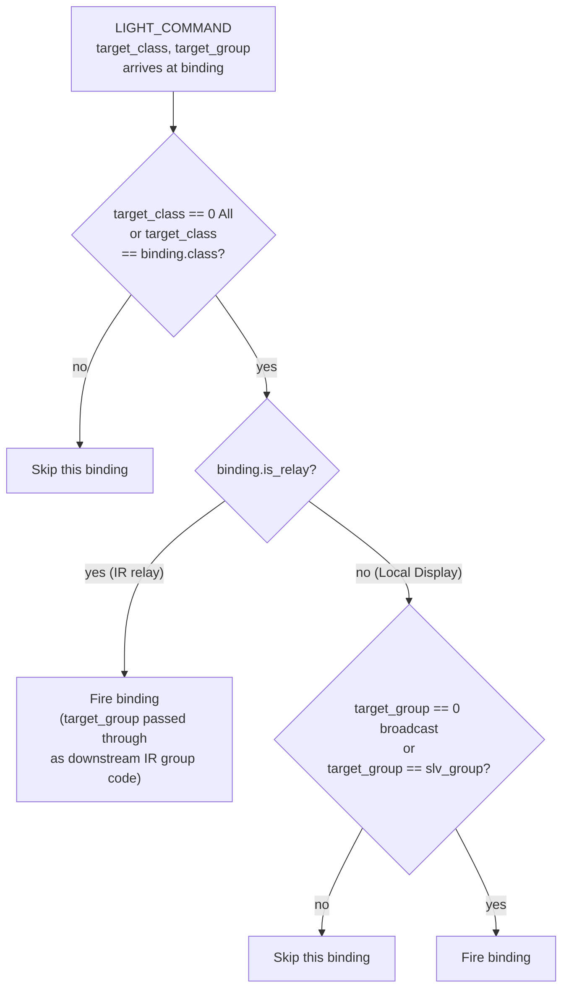
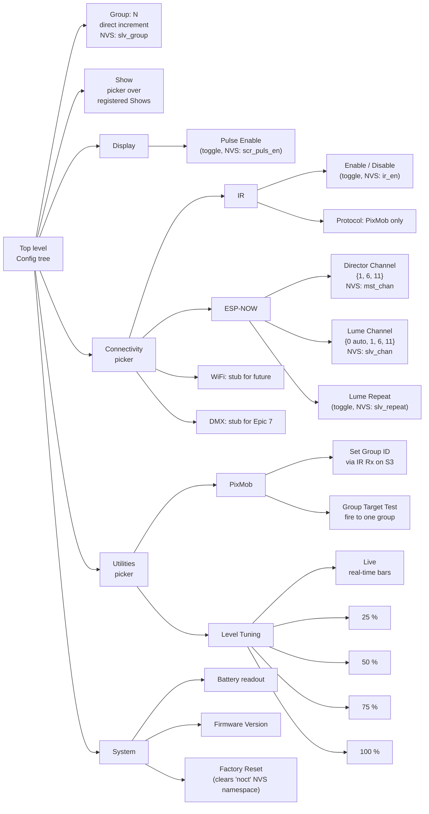
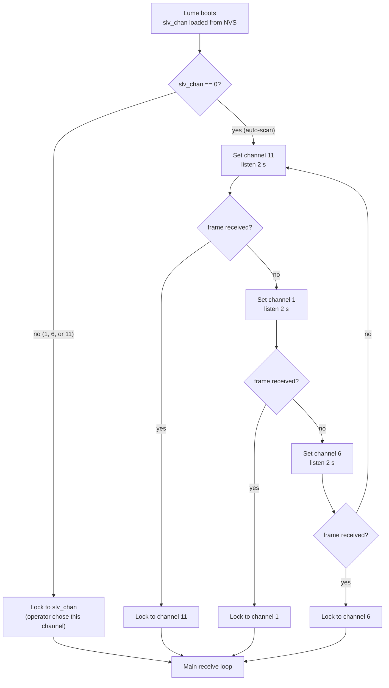
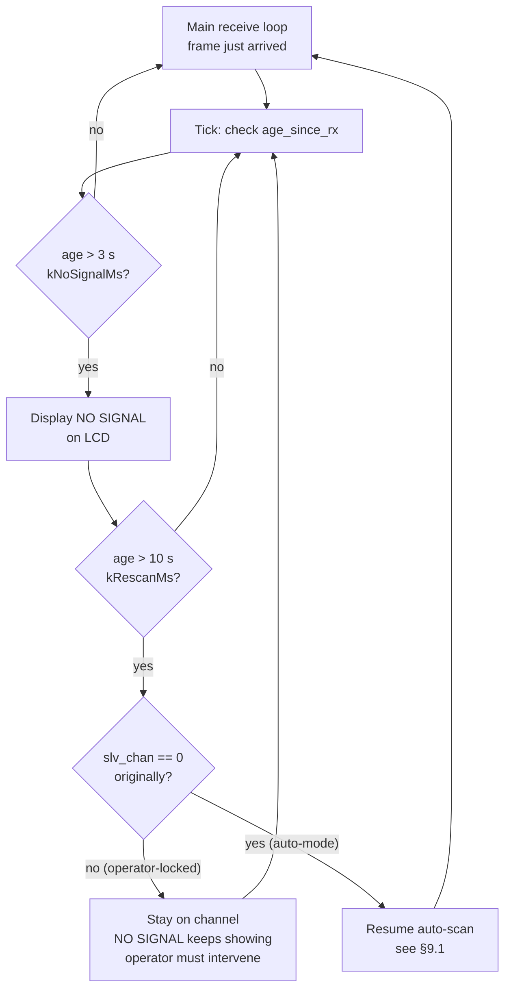

# NocturNation flow diagrams

Reference diagrams for the reference firmware (v0.5, StickC Plus2 + StickS3). Read alongside the [user manual](user-manual.md) for theory of operation context, or alongside the [protocol manual](protocol-manual.md) for byte-level specifications.

Diagrams use [Mermaid](https://mermaid.js.org/) notation. GitHub, Notion, and most modern Markdown renderers display Mermaid blocks natively.

## Contents

1. [System topology](#1-system-topology) - Director, Lumes, bracelets, wires
2. [Boot flow](#2-boot-flow) - power-on through mode resume
3. [Mode finite-state-machine](#3-mode-finite-state-machine) - the runtime modes
4. [Director audio analyser pipeline](#4-director-audio-analyser-pipeline) - mic in, events out
5. [Director render dispatch](#5-director-render-dispatch) - render_fx fan-out
6. [Lume receive pipeline](#6-lume-receive-pipeline) - frame arrival through binding fire
7. [Class-and-group routing](#7-class-and-group-routing) - the addressing decision matrix
8. [Configuration menu tree](#8-configuration-menu-tree) - operator-reachable settings
9. [Channel discovery and re-scan](#9-channel-discovery-and-re-scan) - auto-scan + signal-loss recovery

---

## 1. System topology

The Director runs the active Show, which decides what to send. A Show may consume audio analyser events (microphone), DMX cues (Epic 7), both, or neither. Decisions go out over ESP-NOW to Lumes and locally over IR + LCD; Lumes act as IR range extenders; downstream IR receivers (bracelets) are passive.



Notes:
- The Director is treated as one of its own Lumes for output purposes (the "loopback"): every `render_fx` call also fires the Director's own IR transmitter and LCD pulse.
- IR transmission is gated by the `ir_en` config — a Show can run without IR at all (LCD + ESP-NOW only).
- The IR encoder is protocol-pluggable. PixMob is the reference implementation today; future Lumes can carry different IR encoders without a wire-protocol change.
- A Lume's outputs depend on its hardware. The three example Lumes span the range: Device A renders to its own perimeter LEDs **and** re-fires the command over IR to bracelets; Device B renders to its own perimeter LEDs and terminates there (no IR, no ESP-NOW out); the Lume Tildagon renders to its own perimeter LEDs and LCD but has no IR transmitter. The ESP-NOW frame arrives and renders locally in every case; what differs is what flows onward.
- Lumes are receive-only by default. The Lume-as-repeater toggle re-broadcasts accepted frames at hop_count + 1, capped at 3 hops, where the Lume's hardware and firmware support it. Device B in the diagram has no transmission at all and so cannot relay.
- Bracelets are passive: they wake on an IR command, render the envelope, then return to standby.

---

## 2. Boot flow



The first-boot path picks a random group in {1, 2, 3} and persists it; subsequent boots see the key set and skip the random assignment. The operator can override the group via Config > Group at any time, including setting it to 0 (broadcast-only).

---

## 3. Mode finite-state-machine



Mode IDs are stable across releases (see [protocol manual annex B](protocol-manual.md#annex-b-non-volatile-storage-schema)):
- `0` Boot, `1` Menu, `2` Director, `3` Lume, `4` Config, `5` Test.

---

## 4. Director audio analyser pipeline



The analyser primitives are all Director-internal events. None of them are broadcast on the wire under spec v0.29 — the only Director-emitted frame types are `HEARTBEAT` (1 Hz, skip-if-recent) and `LIGHT_COMMAND` (per Show render). The DropDetector still runs and stamps its output onto `AudioFrameEvent::music_event` (`0` = none, `1` = DROP, `2` = BREAKDOWN, `3` = BUILD reserved). The field is **available as part of the Show toolset** — any Show that wants DROP- or BREAKDOWN-responsive behaviour can read it on `on_audio_frame` and compose a richer `LIGHT_COMMAND` accordingly. No current Show consumes it, but the wiring is intentional. The pre-v0.29 `MUSIC_EVENT` (0x06) standalone-wire broadcast was removed in the protocol trim, but the *Director-internal signal* it once carried is still here, just consumed differently.

---

## 5. Director render dispatch

One `render_fx` call fans out to three sinks: ESP-NOW broadcast, Director IR loopback, Director LCD pulse. Exactly one IR frame is sent per dispatch call. (An Epic 4.7 build inserted a zero-RGB "primer" frame ahead of the main IR fire on idle gaps; bench testing in Epic 4.8 found the extra traffic overloaded the bracelet receivers, so the primer was removed.)



---

## 6. Lume receive pipeline

Every ESP-NOW frame arriving on the channel goes through these checks in order. The magic-prefix check fires first as the cheapest reject for non-NocturNation ESP-NOW traffic sharing the band. Class-and-group routing is unpacked separately in section 7.

```mermaid
flowchart TD
    Recv[ESP-NOW frame arrives]
    Recv --> Magic{magic[0..1]<br/>== 0x4E 0x4E?}
    Magic -- "no" --> DropM[Drop silently<br/>foreign vendor traffic]
    Magic -- "yes" --> Ver{protocol_version<br/>== 0x02?}
    Ver -- "no" --> DropV[Drop silently<br/>wrong NocturNation version]
    Ver -- "yes" --> Dedup{seq in 16-deep<br/>dedup ring?}
    Dedup -- "yes" --> DropD[Drop silently]
    Dedup -- "no" --> Hop{hop_count > 3?}
    Hop -- "yes" --> DropH[Drop silently]
    Hop -- "no" --> Live[Update NO-SIGNAL timer]
    Live --> Type{message_type?}

    Type -- "0x00 HEARTBEAT" --> NoOp[No further action<br/>liveness already updated]
    Type -- "0x03 LIGHT_COMMAND" --> ForEach[For each registered<br/>OutputBinding]
    Type -- "other / 0xFF / reserved" --> DropU[Drop silently<br/>forward-compatible]

    ForEach --> Route[See class-and-group<br/>routing diagram]

    Repeater{Lume-as-repeater<br/>enabled?}
    Hop -- "after dedup OK" --> Repeater
    Repeater -- "yes" --> ReTX[Rebroadcast at<br/>hop_count + 1]
    Repeater -- "no" --> End[Done]
```

---

## 7. Class-and-group routing

The decision applied per binding when a `LIGHT_COMMAND` arrives. The rule is documented normatively in [protocol manual §4.2](protocol-manual.md#42-group-filtering).



Worth re-stating in prose because it catches people out:

- **Broadcast** is sender-side. `target_group == 0` means "address every receiver in this class, regardless of the receiver's own group". The receiver MUST honour it.
- **Group 0 receiver** is *not* a receive-side wildcard. A device with `slv_group == 0` is in no specific group and only renders broadcasts.
- **Relay bindings** (IR relay) bypass the receive-side group filter because the downstream protocol does its own group filtering at the receiver. The downstream group field is set from the inbound NocturNation `target_group` (with PixMob, that's the five-bit group code; other IR encoders carry an equivalent field).

---

## 8. Configuration menu tree

The full operator-reachable settings tree. Reached by long-pressing the lower button from any mode.



Top-level cycle order is `Group → Show → Display → Connectivity → Utilities → System`. Pickers (Connectivity, Utilities) lead to second-level pickers; sub-menus (Display, System) lead directly to leaf items. Long-press BtnB pops one level.

---

## 9. Channel discovery and re-scan

Two related flows: how a fresh Lume finds the Director's channel from cold (auto-scan), and how a locked Lume decides whether to abandon a channel after signal loss (re-scan).

### 9.1 Auto-scan from cold



Channel 11 (show) → 1 (hobby) → 6 (advanced override) → repeat. Worst-case discovery latency from cold is 6 seconds. The order is priority-by-likelihood: channel 11 is most likely to carry a show, channel 6 is least likely.

### 9.2 Re-scan on signal loss



Two thresholds, deliberately decoupled:
- `kNoSignalMs = 3 s` — display NO SIGNAL for operator awareness. Fires fast because operators want to know quickly that something's wrong.
- `kRescanMs = 10 s` — give up on the current channel and start hunting. Fires slow because most signal losses are transient (Director reboot, brief congestion, line of sight blocked). A ~7-second window of "stay on this channel" usually catches recovery faster than a full multi-channel rescan would.

**Operator-locked Lumes never re-scan.** If the operator set `slv_chan ∈ {1, 6, 11}`, the Lume respects that choice indefinitely — NO SIGNAL still displays so the operator notices the outage, but no channel change follows. Only auto-mode Lumes (`slv_chan == 0`) ever re-enter the scan loop.

---

## Maintaining these diagrams

These diagrams are hand-derived from the firmware code. When the firmware changes any of these flows, update the corresponding diagram in this file. The diagrams are deliberately schematic - they exist to support a reader's mental model, not to be a substitute for reading the code. Specific anchors:

- [src/dal/dal.cpp](../../src/dal/dal.cpp) - dispatch fan-out (section 5).
- [src/transport/espnow/frame.cpp](../../src/transport/espnow/frame.cpp) - magic + version + dedup gate at the very top of receive (section 6).
- [src/modes/lume_mode.cpp](../../src/modes/lume_mode.cpp) - receive pipeline, class-and-group routing, channel scan + re-scan (sections 6, 7, 9).
- [src/modes/mode_machine.cpp](../../src/modes/mode_machine.cpp) - mode finite-state-machine (section 3).
- [src/modes/config_mode.cpp](../../src/modes/config_mode.cpp) - configuration tree (section 8).
- [src/modes/persistence.cpp](../../src/modes/persistence.cpp) - first-boot slv_group assignment (section 2).
- [src/dal/analyser/](../../src/dal/analyser/) - audio analyser primitives (section 4).
