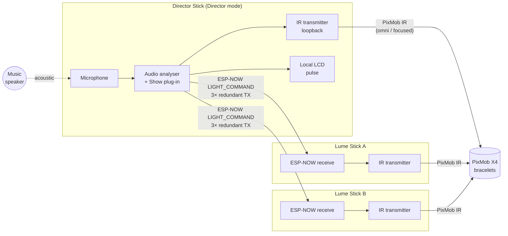
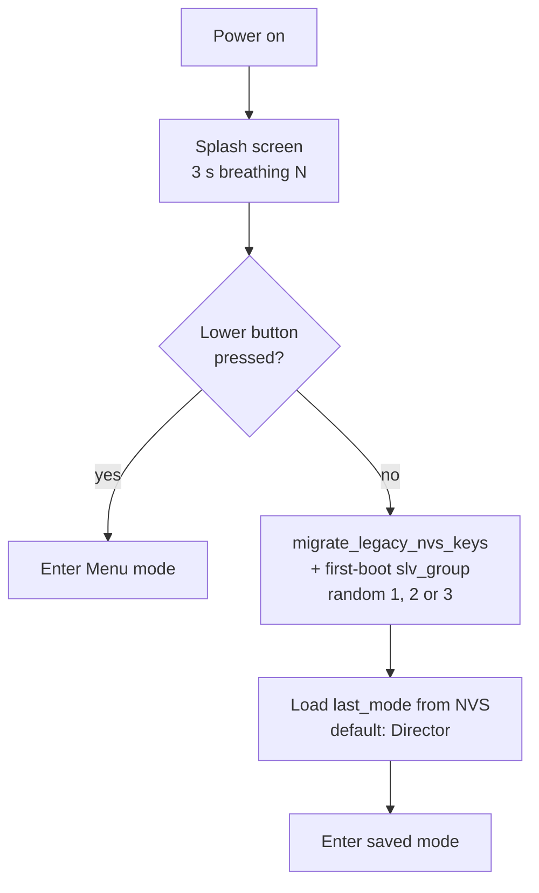
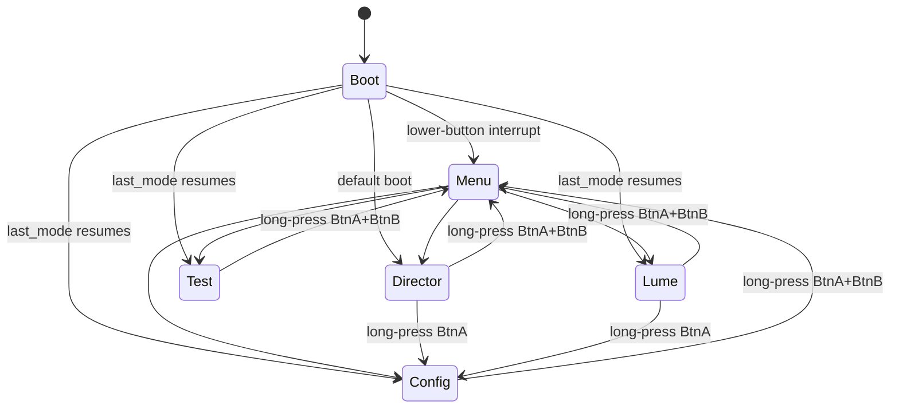
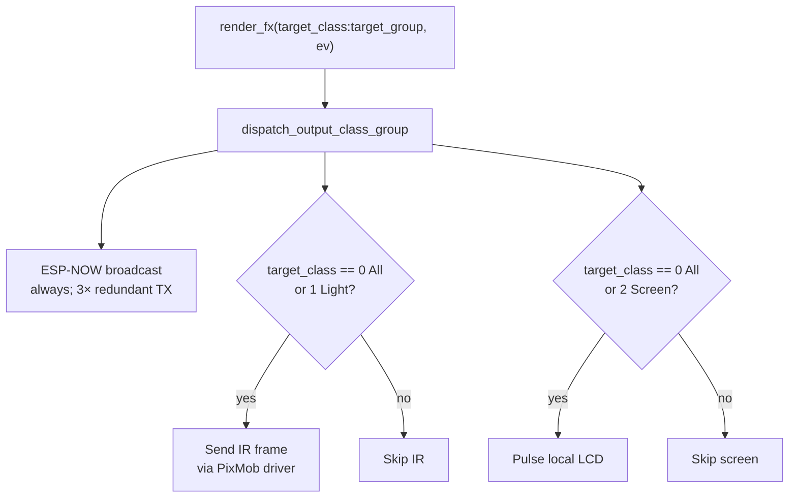
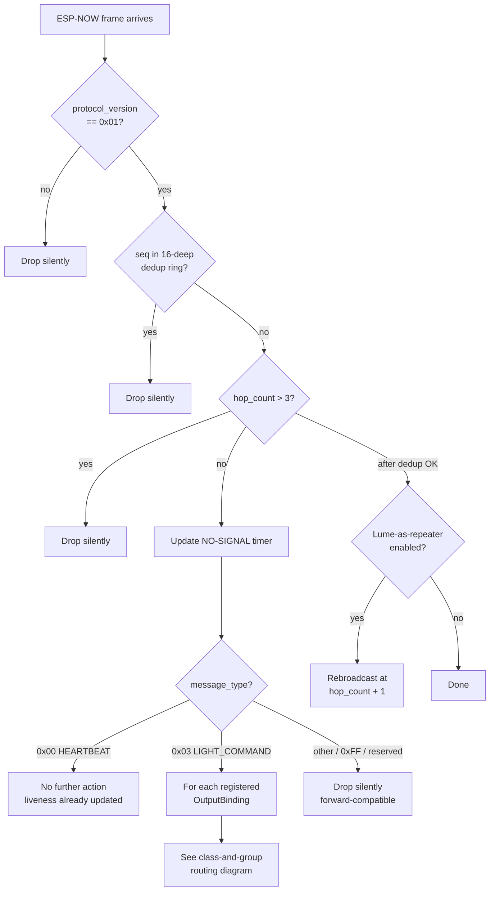
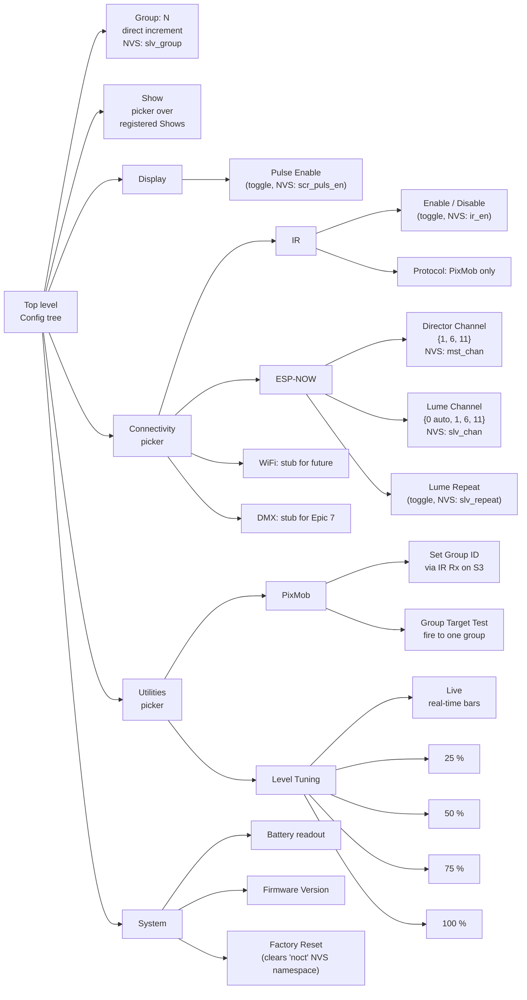

# NocturNation flow diagrams

Reference diagrams for the reference firmware (v0.5, StickC Plus2 + StickS3). Read alongside the [user manual](user-manual.md) for theory of operation context, or alongside the [protocol manual](protocol-manual.md) for byte-level specifications.

Diagrams use [Mermaid](https://mermaid.js.org/) notation. GitHub, Notion, and most modern Markdown renderers display Mermaid blocks natively.

## Contents

1. [System topology](#1-system-topology) - Director, Lumes, bracelets, wires
2. [Boot flow](#2-boot-flow) - power-on through mode resume
3. [Mode finite-state-machine](#3-mode-finite-state-machine) - the runtime modes
4. [Director audio analyser pipeline](#4-director-audio-analyser-pipeline) - mic in, events out
5. [Director render dispatch](#5-director-render-dispatch) - render_fx fan-out
6. [Lume receive pipeline](#6-lume-receive-pipeline) - frame arrival through binding fire
7. [Class-and-group routing](#7-class-and-group-routing) - the addressing decision matrix
8. [Configuration menu tree](#8-configuration-menu-tree) - operator-reachable settings

---

## 1. System topology

The system has three device tiers and two wireless links. The Director listens to audio and broadcasts decisions; Lumes act as IR range extenders; bracelets are passive receivers worn by the audience.

Notes:
- The Director is treated as one of its own Lumes for output purposes (the "loopback"): every `render_fx` call also fires the Director's own IR transmitter and LCD pulse.
- Lumes are receive-only by default. The Lume-as-repeater toggle re-broadcasts accepted frames at hop_count + 1, capped at 3 hops.
- Bracelets are passive: they wake on an IR command, render the envelope, then return to standby.

---

## 2. Boot flow

The first-boot path picks a random group in {1, 2, 3} and persists it; subsequent boots see the key set and skip the random assignment. The operator can override the group via Config > Group at any time, including setting it to 0 (broadcast-only).

---

## 3. Mode finite-state-machine

Mode IDs are stable across releases (see [protocol manual annex B](protocol-manual.md#annex-b-non-volatile-storage-schema)):
- `0` Boot, `1` Menu, `2` Director, `3` Lume, `4` Config, `5` Test.

---

## 4. Director audio analyser pipeline

The analyser primitives are all Director-internal events. None of them are broadcast on the wire under spec v0.29 — the only Director-emitted frame types are `HEARTBEAT` (1 Hz, skip-if-recent) and `LIGHT_COMMAND` (per Show render). The DropDetector still runs internally (it stamps `AudioFrameEvent::music_event`), but its output has no consumer in the v0.29 reference firmware; the pre-v0.29 `MUSIC_EVENT` (0x06) broadcast was removed in the protocol trim along with the DROP / BREAKDOWN effect rendering. The Show plug-in consumes the events it cares about, computes colour and envelope, and dispatches `LIGHT_COMMAND` frames.

---

## 5. Director render dispatch

One `render_fx` call fans out to three sinks: ESP-NOW broadcast, Director IR loopback, Director LCD pulse. Exactly one IR frame is sent per dispatch call. (An Epic 4.7 build inserted a zero-RGB "primer" frame ahead of the main IR fire on idle gaps; bench testing in Epic 4.8 found the extra traffic overloaded the bracelet receivers, so the primer was removed.)

---

## 6. Lume receive pipeline

Every ESP-NOW frame goes through these steps. The class-and-group routing is unpacked separately in section 7.

---

## 7. Class-and-group routing

The decision applied per binding when a `LIGHT_COMMAND` arrives. The rule is documented normatively in [protocol manual §4.2](protocol-manual.md#42-group-filtering).

Worth re-stating in prose because it catches people out:

- **Broadcast** is sender-side. `target_group == 0` means "address every receiver in this class, regardless of the receiver's own group". The receiver MUST honour it.
- **Group 0 receiver** is *not* a receive-side wildcard. A device with `slv_group == 0` is in no specific group and only renders broadcasts.
- **Relay bindings** (PixMob IR) bypass the receive-side group filter because the downstream protocol (PixMob IR) does its own group filtering at the bracelet. The PixMob's five-bit group field is set from the inbound NocturNation `target_group`.

---

## 8. Configuration menu tree

The full operator-reachable settings tree. Reached by long-pressing the lower button from any mode.

Top-level cycle order is `Group → Show → Display → Connectivity → Utilities → System`. Pickers (Connectivity, Utilities) lead to second-level pickers; sub-menus (Display, System) lead directly to leaf items. Long-press BtnB pops one level.

---

## Maintaining these diagrams

These diagrams are hand-derived from the firmware code. When the firmware changes any of these flows, update the corresponding diagram in this file. The diagrams are deliberately schematic - they exist to support a reader's mental model, not to be a substitute for reading the code. Specific anchors:

- [src/dal/dal.cpp](../../src/dal/dal.cpp) - dispatch fan-out (section 5).
- [src/modes/lume_mode.cpp](../../src/modes/lume_mode.cpp) - receive pipeline and class-and-group routing (sections 6 and 7).
- [src/modes/mode_machine.cpp](../../src/modes/mode_machine.cpp) - mode finite-state-machine (section 3).
- [src/modes/config_mode.cpp](../../src/modes/config_mode.cpp) - configuration tree (section 8).
- [src/modes/persistence.cpp](../../src/modes/persistence.cpp) - first-boot slv_group assignment (section 2).
- [src/dal/analyser/](../../src/dal/analyser/) - audio analyser primitives (section 4).
